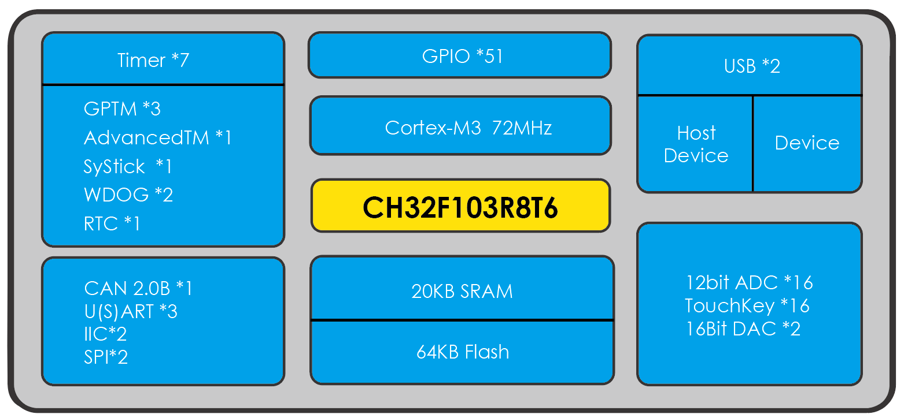

# [CH32F103](https://github.com/SoCXin/CH32F103) 

 

#### [Vendor](https://github.com/SoCXin/Vendor)：[MindMotion](http://www.mm32.com.cn/)
#### [Core](https://github.com/SoCXin/Cortex)：[Cortex M0](https://github.com/SoCXin/CM0) 
#### [Level](https://github.com/SoCXin/Level)：96MHz 

## [描述](https://github.com/SoCXin/CH32F103/wiki) 

[CH32F103](https://github.com/SoCXin/CH32F103) 系列是基于32位Cortex-M3内核设计的通用微控制器。片上集成了时钟安全机制、多级电源管理、 通用DMA控制器等。 此系列具有 2 路 USB2.0接口、多通道 TouchKey、 12 位 DAC 转换模块，多通道 12 位 ADC、 多组定时器、 CAN 通讯控制器、 I2C/USART/SPI 等丰富的外设资源。

 

### [资源收录](https://github.com/SoCXin/CH32F103)

* [文档](docs/)
* [资源](src/)

### [选型建议](https://github.com/SoCXin)

[CH32F103](https://github.com/SoCXin/CH32F103) 相较于其他的XX32XXX产品，接口相对集中丰富，具有USB、CAN2.0B 、DAC，支持5.5V电压

###  [SoC芯平台](http://www.SoC.Xin) 
